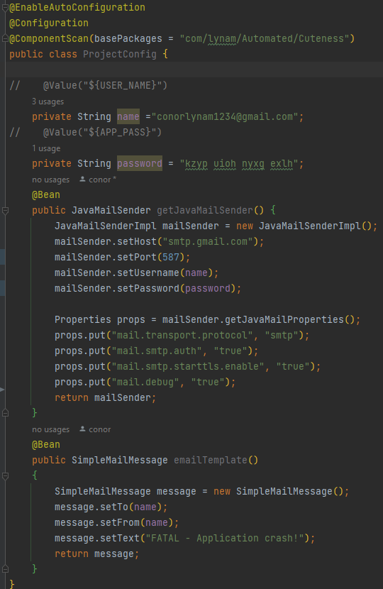

# Automated-Cuteness
This project was created to explore Docker, hosting, and other concepts encountered in my professional journey. The idea originated as a joke with a friend - what if we could automate aspects of the dating process? Thus, Automated-Cuteness was born.

While the application cannot take your partner on a physical date or impress their friends, it aims to convey thoughtfulness even during busy times. The app makes a call to a Quote API, generates a quote, concatenates the quote, and sends it as a text message using the Twilio API.

## Technologies
- Spring Boot
- Postgres
- Twilio API
- Quotable API
- Docker
- Maven

## How to Start
To use this application, you must:

1. Create an account with Twilio (https://www.twilio.com/en-us).
2. Get your SIDTwilio, Auth, number, and outgoing number.
3. Create a class called TwilioSID.
4. Populate the class with fields for SIDTwilio, Auth, number, and outgoing number.
5. Create getters for each of these fields.
6. Set the `application.properties`, `spring.profiles.active=dev`.
7. Run the project and call http://localhost:8080/sms.

If my server is still hosted, you can try to make a call to https://automated-cuteness.onrender.com/sms for the fun of it.

## Response Example 
Quote:The doorstep to the temple of wisdom is a knowledge of our own ignorance. Author:Benjamin Franklin.

## What I Learned
I encountered several learning opportunities throughout this project:

1. Creating and referencing environment variables using @Value annotation.
2. How to create and run a JAR file. (mvn clean install)
3. Some bugs only occur when running from certain environments. My project worked perfectly when running from the IDE. However, a number of bugs occurred when running from the JAR file. After what felt like weeks of searching, I eventually found out that the @Value annotation can cause trouble when running from a JAR file. I got around this by creating the TwilioSID class, creating fields for my values, and adding it to the .gitignore file.
4. How to create a Docker file.
5. Creating a Docker image and running Docker containers.
6. That Docker Hub was a thing?? How to log in from the command line, push and pull to Docker Hub.
7. Hosting an application. This was the most frustrating part of the project. It really highlighted the importance of being able to properly phrase our problems. I believed that I could put the app image and a Postgres image into one container, push the container to the Hub, and host the Hub repo. Eventually, I discovered that you can only host one image at a time from the Hub. After some thinking, I decided to create a remote Postgres database, host my app, and link the two together.
8. SOMETHING REALLY OBVIOUS: Books are a great source of information! When I was really frustrated, I asked some seasoned Spring developers for advice. I was pointed to the book Spring Start Here. It showed me how shallow my Spring knowledge was and how much I can learn.
9. Ask for help. Ask the people around you. Ask people on the internet. Ask people who know more than you and ask people who know less than you. I can't tell you how many times I was in the middle of describing a problem to someone, and the answer jumped into my head.

## Contributions

Feel free to contribute or provide feedback. If you encounter issues or have suggestions, please open an issue.

## Update
Update

Twilio, the sms service, have changed their policy. I can no longer use a trial account to get an Irish number. 
For the time being this project does not work. As a part of a screening at work I decided to update this project. 
Instead of using sms it now sends emails using Spring Mail.

My favourite part of this new version is the bean I created to configure the email service.
